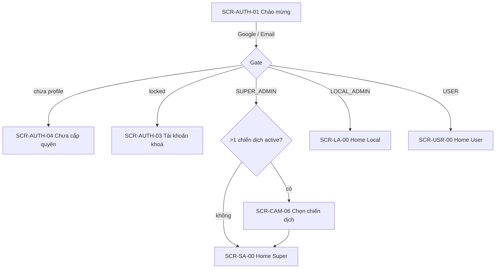
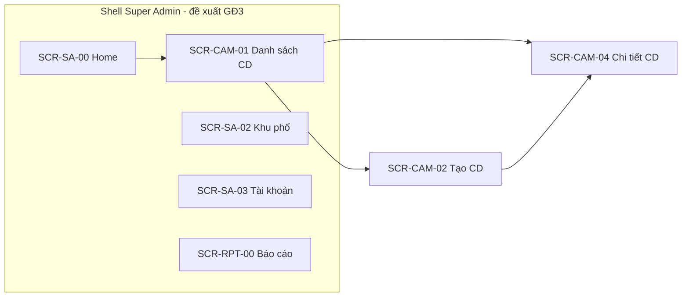
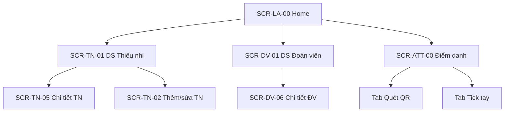

# MHX-Attendance — Wireframes & Information Architecture

> **Mục đích:** Một “bản đồ màn hình” thống nhất trước khi code UI. Mỗi task README (`CAM-01`, `TN-02`…) gắn với **Screen ID** và **route** ở đây.
>
> **Cập nhật:** Khi thêm/sửa màn hình → sửa file này trước hoặc cùng lúc với PR.

---

## 1. Nguyên tắc thiết kế UI

| Nguyên tắc | Mô tả |
|------------|--------|
| **Một chiến dịch = một ngữ cảnh** | Super Admin / Local Admin chọn `selectedCampaign` trước khi vào nghiệp vụ |
| **Ba “app con” theo role** | Super Admin · Local Admin · User — không trộn menu |
| **Danh sách → Chi tiết → Form** | Pattern lặp lại cho Chiến dịch, Khu phố, Thành viên, Hoạt động |
| **Không xoá cứng thành viên** | Chỉ `is_active = false` |
| **Material 3** | Màu chủ đạo `#1565C0` (xem `AppColors.primary`) |

### Shell đề xuất (từ Giai đoạn 3)

| Role | Điều hướng chính | Ghi chú |
|------|------------------|---------|
| **Super Admin** | `NavigationRail` (Windows) / `NavigationBar` (mobile) | Trang chủ · Chiến dịch · Khu phố · Tài khoản · Báo cáo |
| **Local Admin** | 4 tab: Trang chủ · Thiếu nhi · Đoàn viên · Điểm danh | Khu phố cố định theo tài khoản |
| **User** | 3 tab: Trang chủ · Hoạt động · QR của tôi | Đoàn viên |

**Super Admin shell** (`NavigationRail`) đã có từ Giai đoạn 3 — xem `lib/features/dashboard_super/`.

---

## 2. Luồng đăng nhập (chung)



| Screen ID | Tên | Route | Trạng thái |
|-----------|-----|-------|------------|
| `SCR-AUTH-01` | Chào mừng / Đăng nhập | `/login` | ✅ |
| `SCR-AUTH-02` | Đăng nhập email | `/login/email` | ✅ |
| `SCR-AUTH-02b` | Đăng ký | `/register` | ✅ |
| `SCR-AUTH-03` | Tài khoản khoá | `/locked` | ✅ |
| `SCR-AUTH-04` | Chưa cấp quyền | `/unauthorized` | ✅ |

---

## 3. Super Admin

### 3.1 Sơ đồ điều hướng



### 3.2 Bảng màn hình

| Screen ID | Task | Tên màn hình | Route | Trạng thái |
|-----------|------|--------------|-------|------------|
| `SCR-SA-00` | SA-01 | Trang chủ Ban chỉ huy | `/home/super` | 🟡 dashboard (shell ✅) |
| `SCR-CAM-06` | CAM-06 | Chọn chiến dịch | `/campaigns/select` | ✅ |
| `SCR-CAM-01` | CAM-01 | Danh sách chiến dịch | `/campaigns` | ✅ |
| `SCR-CAM-02` | CAM-02 | Tạo chiến dịch | `/campaigns/new` | ✅ |
| `SCR-CAM-04` | CAM-04 | Chi tiết chiến dịch | `/campaigns/:id` | ✅ (sửa, bật/tắt, gán BT, xóa) |
| `SCR-SA-02` | SA-02 | Danh sách / form khu phố | `/neighborhoods` | ⬜ GĐ3 |
| `SCR-SA-03` | SA-03 | Danh sách Local Admin | `/admins` | ⬜ GĐ3 |
| `SCR-SA-04` | SA-04 | Cấp quyền Local Admin | `/admins/grant` | ⬜ GĐ3 |
| `SCR-MEM-SA` | MEM-02 | Xem TN/ĐV toàn địa bàn (read-only) | `/members` | ⬜ GĐ4 |
| `SCR-RPT-00` | RPT-* | Báo cáo & thống kê | `/reports` | ⬜ GĐ8 |

### 3.3 Wireframe — Trang chủ Super Admin (`SCR-SA-00`)

```
┌─────────────────────────────────────┐
│ ☰  Ban chỉ huy          [Đăng xuất]│
├─────────────────────────────────────┤
│  [Avatar]  Họ tên                   │
│  Chip: SUPER_ADMIN                  │
│  Chiến dịch đang chọn: MHX-2026     │
│  [Đổi chiến dịch]                   │
├─────────────────────────────────────┤
│  (GĐ3) Thẻ thống kê: TN / ĐV / HĐ   │
│  (GĐ3) Biểu đồ điểm danh tuần       │
├─────────────────────────────────────┤
│  [Quản lý chiến dịch]  ← hiện có   │
│  (GĐ3) [Khu phố] [Tài khoản]        │
│  (GĐ8) [Báo cáo]                    │
└─────────────────────────────────────┘
```

### 3.4 Wireframe — Tạo chiến dịch (`SCR-CAM-02`) ✅

```
┌─────────────────────────────────────┐
│ ←  Tạo chiến dịch                   │
├─────────────────────────────────────┤
│  Mã viết tắt    [MHX____]           │
│  Tên chiến dịch [____________]      │
│  Năm            [2026]              │
│  Ngày bắt đầu   [Chọn ngày 📅]      │
│  Ngày kết thúc  [Chọn ngày 📅]      │
│                                     │
│  [        Lưu        ]              │
└─────────────────────────────────────┘
```

### 3.5 Wireframe — Chi tiết chiến dịch (`SCR-CAM-04`) ✅

```
┌─────────────────────────────────────┐
│ ←  Mùa Hè Xanh 2026      [🗑] [✎]  │
├─────────────────────────────────────┤
│  Card: MHX-2026 · ngày · năm         │
│  Switch: Kích hoạt chiến dịch       │
├─────────────────────────────────────┤
│  Khu phố tham gia    [+ Thêm Bí thư]│
│  ┌ KP03 — Nguyễn Văn A        [x] ┐ │
│  └ ...                            ┘ │
└─────────────────────────────────────┘
```

---

## 4. Local Admin

### 4.1 Sơ đồ điều hướng



### 4.2 Bảng màn hình (tóm tắt)

| Screen ID | Task | Tên | Route đề xuất | GĐ |
|-----------|------|-----|---------------|-----|
| `SCR-LA-00` | — | Trang chủ Bí thư | `/home/local` | 🟡 |
| `SCR-TN-01` | TN-01 | Danh sách thiếu nhi | `/thieu-nhi` | 4 |
| `SCR-TN-02` | TN-02 | Thêm thiếu nhi | `/thieu-nhi/new` | 4 |
| `SCR-TN-05` | TN-05 | Chi tiết thiếu nhi | `/thieu-nhi/:id` | 4 |
| `SCR-DV-01` | DV-01 | Danh sách đoàn viên | `/doan-vien` | 4 |
| `SCR-DV-06` | DV-06 | Chi tiết đoàn viên | `/doan-vien/:id` | 4 |
| `SCR-ACT-01` | ACT-01 | Danh sách hoạt động | `/activities` | 6 |
| `SCR-ATT-00` | ATT-* | Điểm danh (2 tab) | `/attendance` | 7 |
| `SCR-QR-*` | QR-* | In thẻ QR | `/qr-cards` | 5 |

### 4.3 Wireframe — Điểm danh (`SCR-ATT-00`)

```
┌─────────────────────────────────────┐
│  Điểm danh — Hoạt động: [chọn ▼]   │
├─────────────────────────────────────┤
│  [ Quét QR ]  [ Tick tay ]          │  ← TabBar
├─────────────────────────────────────┤
│  Tab QR:                            │
│    [ Khung camera quét ]            │
│    → Sheet xác nhận: Tên + điểm     │
│  Tab Tay:                           │
│    [🔍 Tìm]                         │
│    ☐ Nguyễn Văn A                   │
│    ☐ Trần Thị B                     │
│    [ Lưu điểm danh ]                │
└─────────────────────────────────────┘
```

---

## 5. User (Đoàn viên)

| Screen ID | Task | Tên | Route đề xuất | GĐ |
|-----------|------|-----|---------------|-----|
| `SCR-USR-00` | USR-01 | Trang chủ đoàn viên | `/home/user` | 🟡 |
| `SCR-USR-QR` | USR-02 | QR cá nhân fullscreen | `/my-qr` | 9 |
| `SCR-USR-ACT` | USR-04 | Hoạt động | `/activities` | 9 |
| `SCR-USR-HIS` | USR-03 | Lịch sử & biểu đồ điểm | `/history` | 9 |

```
┌─────────────────────────────────────┐
│  Xin chào, [Tên]        [Đăng xuất]│
├─────────────────────────────────────┤
│  Tổng điểm: 120    Hạng KP: #3      │
│  [══════ QR của tôi ══════]         │
├─────────────────────────────────────┤
│  Hoạt động sắp tới                  │
│  • Dọn vệ sinh kênh ...  [Tham gia] │
└─────────────────────────────────────┘
```

---

## 6. Chung (mọi role)

| Screen ID | Task | Tên | Route đề xuất |
|-----------|------|-----|---------------|
| `SCR-PRF-01` | PRF-01 | Hồ sơ cá nhân | `/profile` |

Truy cập: icon avatar trên AppBar hoặc mục cuối menu.

---

## 7. Quy ước khi implement

1. **Đặt tên file theo feature + screen ID**  
   Vd. `campaign_list_screen.dart` ↔ `SCR-CAM-01`

2. **Route khai báo trong `*_routes.dart`** — không hard-code string rải rác.

3. **Trước khi code màn mới:** thêm 1 dòng vào bảng §3/§4/§5 + wireframe ASCII (có thể sơ).

4. **Trạng thái:** ✅ xong · 🟡 placeholder · ⬜ chưa làm

5. **Figma (tuỳ chọn):** Link design file đặt ở đây khi có:
   `<!-- Figma: https://... -->`

---

## 8. Lộ trình gắn wireframe ↔ code

| Giai đoạn | Ưu tiên UI | Shell |
|-----------|------------|-------|
| **2** ✅ | Chiến dịch CRUD | Trong shell SA |
| **3** | Khu phố, tài khoản, thống kê dashboard | Shell SA ✅ · placeholder nav |
| **4** | 2 trang TN + DV (không tab chung) | Shell LA |
| **5–7** | QR, Hoạt động, Điểm danh | Giữ shell LA |
| **8–9** | Báo cáo, User tabs | Shell USR |
| **10** | Profile | Modal / push |

---

## 9. Việc làm tiếp theo (đề xuất)

- [ ] Chốt **Figma** hoặc giữ ASCII wireframe trong repo này
- [ ] Implement `SuperAdminShell` + `NavigationRail` (GĐ3, task SA-01)
- [ ] Gắn link file này vào [README.md](../README.md) mục lục
- [ ] Mỗi PR UI: checkbox “đã cập nhật `docs/WIREFRAMES.md`”
